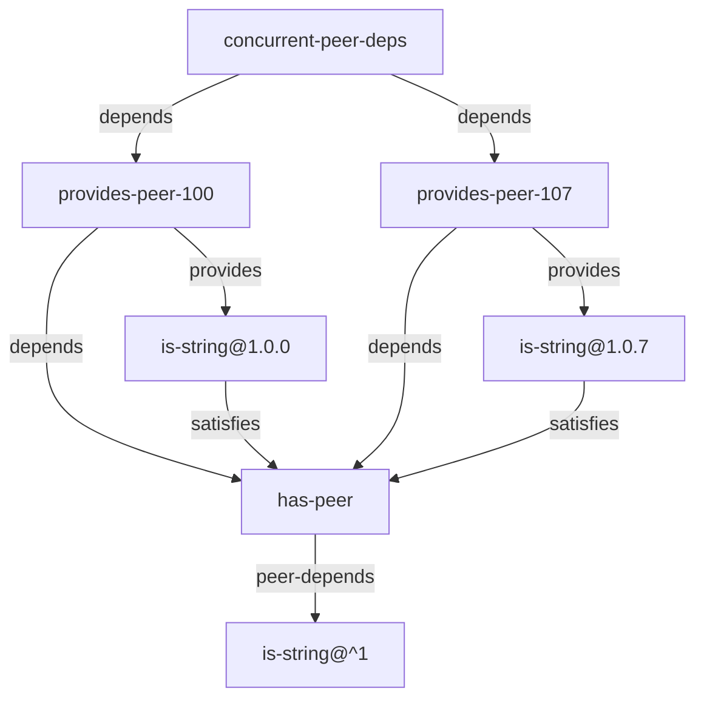

# Integration test: concurrent-versions

Test includes a common peer dependency in different versions.   
This needs to be reflected in the SBOM by listing this peer dep multiple times with their own version, especially in dependency tree.

