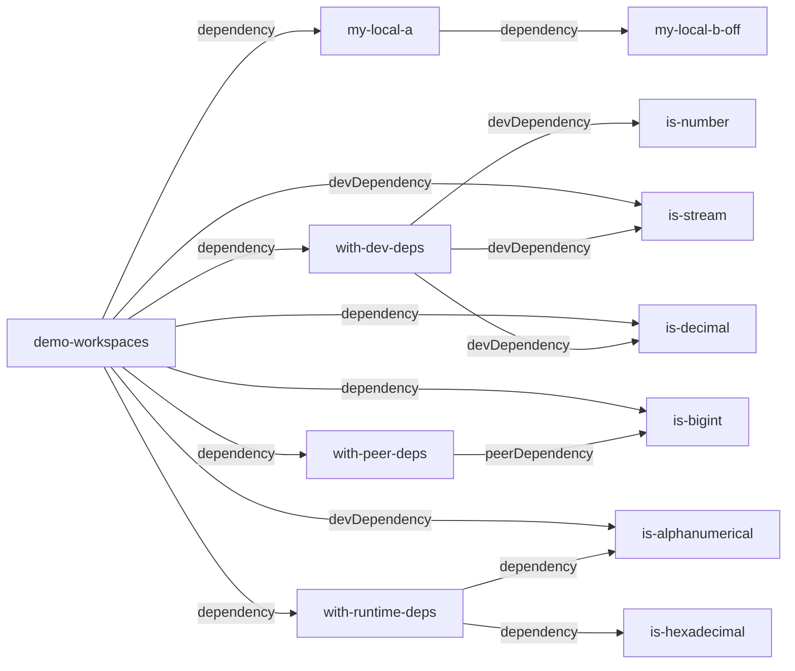

# Integration test: local workspaces

*ATTENTION*: this demo might use known vulnerable dependencies for showcasing purposes.

Install local workspaces and see how they behave.

some cases are related to <https://github.com/CycloneDX/cyclonedx-node-yarn/issues/256>

## dependency structure

